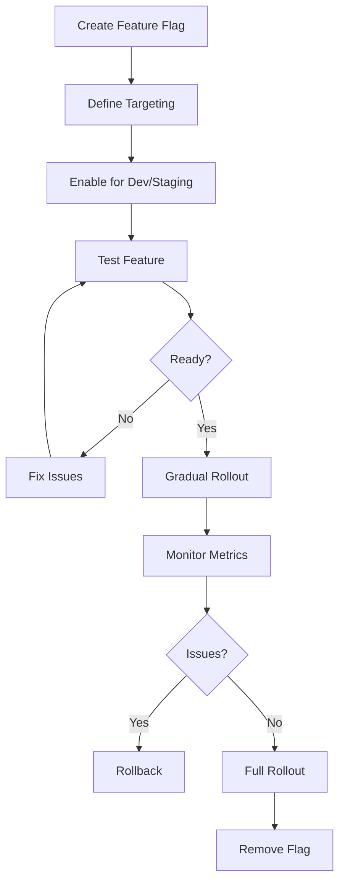

> Controlled feature rollout with Pennant and PostHog

---

## Quick Links

| Resource | Link |
|----------|------|
| **PostHog** | [Feature Flags Dashboard](https://us.posthog.com/project/flags) |
| **Nova Admin** | [Pennant Features](https://tc-portal.test/nova/resources/pennant-features) |

---

## TL;DR

- **What**: Control feature visibility, gradual rollouts, and A/B testing
- **Who**: Developers, Product Team
- **Key flow**: Create Flag → Target Users/Orgs → Roll Out Gradually → Monitor
- **Watch out**: Pennant uses PostHog as store in production - check both systems

---

## Key Concepts

| Term | What it means |
|------|---------------|
| **Feature Flag** | Toggle controlling feature visibility |
| **Rollout** | Gradual release to percentage of users |
| **A/B Test** | Experiment comparing feature variants |
| **Scope** | What the flag applies to (user, org, global) |

---

## How It Works

### Main Flow: Feature Rollout



---

## Stack

| Layer | Technology | Purpose |
|-------|------------|---------|
| **Backend** | Laravel Pennant | Server-side feature checks |
| **Frontend** | PostHog | Client-side flags and experiments |
| **Storage** | PostHog | Flag state persistence |

---

## Environment Setup

```env
POSTHOG_KEY=
POSTHOG_HOST=https://us.i.posthog.com
POSTHOG_ENABLED=true
PENNANT_STORE=posthog
VITE_POSTHOG_KEY=
```

By default, Pennant uses the database driver. Set `PENNANT_STORE=posthog` to use PostHog locally.

---

## Usage

### Backend (Laravel)

```php
use Laravel\Pennant\Feature;

if (Feature::active('new-feature-flag-name')) {
    // Feature is enabled
} else {
    // Feature is disabled
}

// Check for specific scope
if (Feature::for($user)->active('premium-feature')) {
    // User has access
}
```

### Frontend (Vue)

```vue
<script setup>
import { useFeatureFlag } from '@/Composables/usePostHog'

const showNewFeature = useFeatureFlag('new-feature-flag-name')
</script>

<template>
  <NewFeature v-if="showNewFeature" />
  <OldFeature v-else />
</template>
```

---

## Business Rules

| Rule | Why |
|------|-----|
| **Clean up after rollout** | Remove flags once feature is stable |
| **Document all flags** | Track what each flag controls |
| **Use consistent naming** | `kebab-case-feature-name` |

---

## Who Uses This

| Role | What they do |
|------|--------------|
| **Developers** | Create and manage feature flags |
| **Product Team** | Define rollout strategy |

---

## Technical Reference

<details>
<summary><strong>Feature Definitions</strong></summary>

```
app/Features/
├── NewBudgetEditor.php
├── SupplierPortalV2.php
└── ...
```

Each feature extends Pennant's Feature class with targeting logic.

</details>

---

## Open Questions

| Question | Context |
|----------|---------|
| **Mixed flag sources?** | PostHog, Pennant database, AND Nova settings (Klaviyo) - three sources of truth |
| **Should all flags be in app/Features/?** | Only `ToggleKlaviyoFeature.php` exists - most managed directly in PostHog |

---

## Active Feature Flags

| Flag | Usage | Purpose |
|------|-------|---------|
| `invoice-submitted-visibility` | Bills tables | Controls submitted invoice status visibility |
| `care-coordinator-bill-submission` | CareCoordinatorBillController | Controls CC bill submission |
| `workos-auth` | FortifyServiceProvider | Controls WorkOS SSO integration |
| `recipient-bill-submission` | PackageBillList.vue | Controls recipient bill submission |
| `ff_klaviyo_integration` | ToggleKlaviyoFeature.php | Klaviyo email integration (via Nova settings) |

---

## Technical Reference (Expanded)

<details>
<summary><strong>Implementation Details</strong></summary>

### app/Features/ Contents

```
app/Features/
├── ToggleKlaviyoFeature.php    # Only custom feature class
└── aREADME.md                  # Documentation
```

### Frontend Components

```
resources/js/Components/
└── HasFeatureFlag.vue          # Reusable wrapper with enabled/disabled slots
    - Props: feature (string)
    - Uses posthog.isFeatureEnabled()

resources/js/composables/
└── posthog.ts                  # Vue composable for PostHog integration
```

### Middleware

```
app/Http/Middleware/
└── CheckFeatureFlag.php        # Route-level protection, returns 403 if inactive
```

### Pennant Drivers (config/pennant.php)

| Driver | Use |
|--------|-----|
| `array` | In-memory (testing) |
| `database` | Default development |
| `posthog` | Production |

</details>

---

## Related

### Integrations

- [PostHog](/features/tools/posthog) — analytics and feature flags platform

---

## Status

**Maturity**: Production
**Pod**: Platform (Infrastructure)
