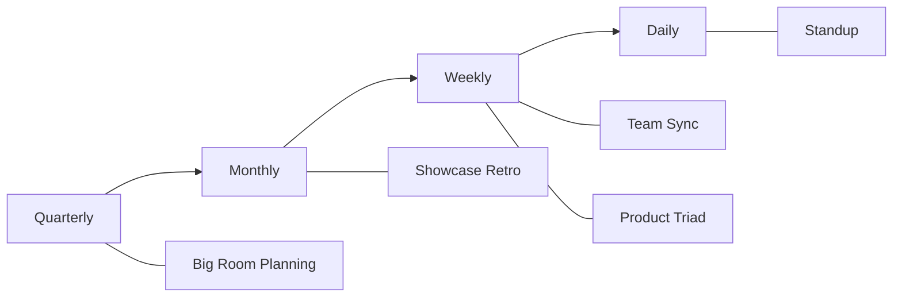

Our meetings follow a clear cadence. Each has a purpose—if it doesn't, we cancel it.

---

## QTRLY - Big Room Planning

**Cadence:** Quarterly (every 3 months)
**Duration:** Half-day to full-day

Strategic alignment across all teams. Set quarterly objectives, review capacity, identify cross-team dependencies.

**Attendees:** Leadership, Tech Leads, Product, Design
**Output:** Quarterly roadmap, team commitments, dependency map

---

## MONTHLY - Product Showcase Retro

**Cadence:** Monthly
**Duration:** 60-90 minutes

Demo what shipped. Celebrate wins. Reflect on what worked and what didn't.

**Attendees:** All product & engineering
**Output:** Demo recordings, retro action items

---

## WEEKLY - Team Weekly Meeting

**Cadence:** Weekly
**Duration:** 30-45 minutes

Team sync on sprint progress, blockers, and upcoming work.

**Attendees:** Delivery team
**Output:** Updated sprint board, blocker escalations

---

## WEEKLY/FORTNIGHTLY - Product Checkin

**Cadence:** Weekly or Fortnightly
**Duration:** 60 minutes

Cross-functional sync covering all product domains. Deep dive into current initiatives, blockers, and upcoming work.

**Attendees:** Product, Design, Tech Leads, Business Analysts
**Output:** Action items by person, domain updates, decisions captured

### Format

Each checkin captures:
- **Action items** by person (Bruce, Beth, David, Tim, Romy, etc.)
- **Domain updates** (Invoice Processing, Budgets, Care Partner Portal, etc.)
- **Technical infrastructure** decisions
- **Operational reporting** status

### Domains Covered

| Domain | Owner | Focus |
|--------|-------|-------|
| Budgets & Financial | Bruce | Budget UI, invoices, collections, statements |
| Accounts & Invoices | Matthew | Invoice processing, API integration |
| Supplier Onboarding | Zoe | Supplier portal, onboarding flows |
| Care Partner Portal | Beth | Portal IA, tasks, threads, calls |
| Onboarding | Anthony | Fast track, eligibility, questionnaires |
| Claims & Data | Marleze | Claims API, collections, integrations |

### Key Principles

- **Centralized bug management** to reduce dev context switching
- **Traffic light priority** for triage (critical → immediate, enhancements → discovery)
- **Weekly care partner feedback** sessions (Friday) feed into checkins
- **Design stays ahead of dev** through triad alignment

---

## WEEKLY - Product Triad

**Cadence:** Weekly
**Duration:** 30-40 minutes

Cross-domain alignment between Design, Tech, and Business. Triage upcoming work from Idea → PRD → Production.

**Goal:** Design the right thing. Build the thing right.

### Attendees

| Role | Focus |
|------|-------|
| Designer | Desirability - Users, flows, edge cases, constraints |
| Tech Lead | Feasibility - Risks, dependencies, architecture, sizing |
| Business Analyst | Viability - Problem statement, value, outcomes, appetite |

### Agenda

| Time | Activity |
|------|----------|
| 2 min | Kick-off & Priorities |
| 5 min | Pipeline Snapshot |
| 20-25 min | Item Deep-Dives (6-7 min each) |
| 3-5 min | Devil's Advocate Sweep |
| 3 min | Wrap & Next Steps |

### Pipeline Stages

| Stage | Description |
|-------|-------------|
| **Ideas** | Raw thought. No homework done yet. |
| **Discovery** | Light research, UX sketches, tech feasibility, business value checks. |
| **Draft PRD** | First-pass write-up of what we plan to build and why. |

### Deep-Dive Decisions

| Decision | Meaning |
|----------|---------|
| **Advance** | Move to next stage (Draft PRD or delivery backlog) |
| **Explore** | Needs spike / interview / prototype / research |
| **Park** | Not priority or unclear—revisit later |

### Working Agreements

- **One page or it didn't happen:** Keep discovery notes and PRDs concise
- **Time-boxed debates:** If taking >3 minutes, spin off an action
- **Evidence beats opinion:** Link to data, interviews, or spikes
- **Smallest viable first:** Prefer MVP path
- **Clear ownership:** Every action has a single owner and date

### Lightweight Templates

**Problem Statement:**
> For [user], the problem is [x], which causes [y]. Success = [metric].

**Scope Boundaries:**
> Included: [a, b]. Excluded: [c].

**MVP Cut:**
> Earliest shippable version is [feature set], risks are [r1, r2].

**Output:** Pipeline status updates, PRD candidates, action items

---

## DAILY - Standup (coming soon)

**Cadence:** Daily
**Duration:** 15 minutes max

Quick sync on yesterday/today/blockers. Keep it short.

**Attendees:** Delivery team
**Output:** Shared awareness, blocker escalation

---

## AD-HOC - Story Kick Offs & Desk Checks

Story Kick Offs and Desk Checks bookend development work—ensuring alignment at the start and quality at the end.

### Story Kick Off

**When:** Before developer starts work
**Who:** Developer, Designer (if UI), BA/PM
**Duration:** 10-15 minutes

| Checklist |
|-----------|
| Developer understands the "why" |
| Acceptance criteria are clear |
| Design reviewed (if applicable) |
| Technical approach discussed |
| Dependencies identified |

### Desk Check

**When:** Before PR is raised (code complete, locally tested)
**Who:** Developer, Designer (if UI), BA/PM
**Duration:** 10-20 minutes

| Checklist |
|-----------|
| Demo feature locally |
| Walk through acceptance criteria |
| Designer confirms visual/UX |
| BA/PM confirms business logic |
| Edge cases demonstrated |

### PR Time Target

> **PR review time should be half the development time.**

| Dev Time | Target PR Time |
|----------|----------------|
| 1 day | 4 hours |
| 2 days | 1 day |
| Half day | 2 hours |

---

## AD-HOC - Workshops

**Cadence:** As needed (typically during discovery/planning phases)
**Duration:** 60-120 minutes

Deep-dive sessions on specific features or domains. Used to align stakeholders, gather requirements, and make design decisions before development.

**Attendees:** Relevant stakeholders (varies by topic)
**Output:** Requirements, decisions, design direction

### Common Workshop Topics

| Topic | Purpose |
|-------|---------|
| Budget v2 | Financial features, UI design, calculations |
| Package Onboarding | Client journey, workflow automation |
| Supplier Onboarding | Supplier portal, verification flows |
| Statements | Financial reporting, PDF generation |
| Claims / Care Management | Claiming workflows, API integration |
| OT Report AI Analysis | AI-assisted reporting, automation |

### Workshop Format

1. **Context setting** - What problem are we solving?
2. **Current state** - How does it work today?
3. **Requirements gathering** - What do stakeholders need?
4. **Design exploration** - What are the options?
5. **Decisions** - What are we committing to?
6. **Next steps** - Who does what by when?

### When to Run a Workshop

- New feature kickoff
- Complex requirements need alignment
- Multiple stakeholders have conflicting views
- Technical approach needs validation
- Design decisions need business input

---

## ONGOING - Teams Product Chat

**Cadence:** Async / as needed
**Duration:** N/A

Continuous discussion in Teams for quick questions, decisions, and updates that don't warrant a meeting.

**Channel:** Product Team Chat
**Output:** Captured decisions (use `/trilogy.teams-summary` to extract)
