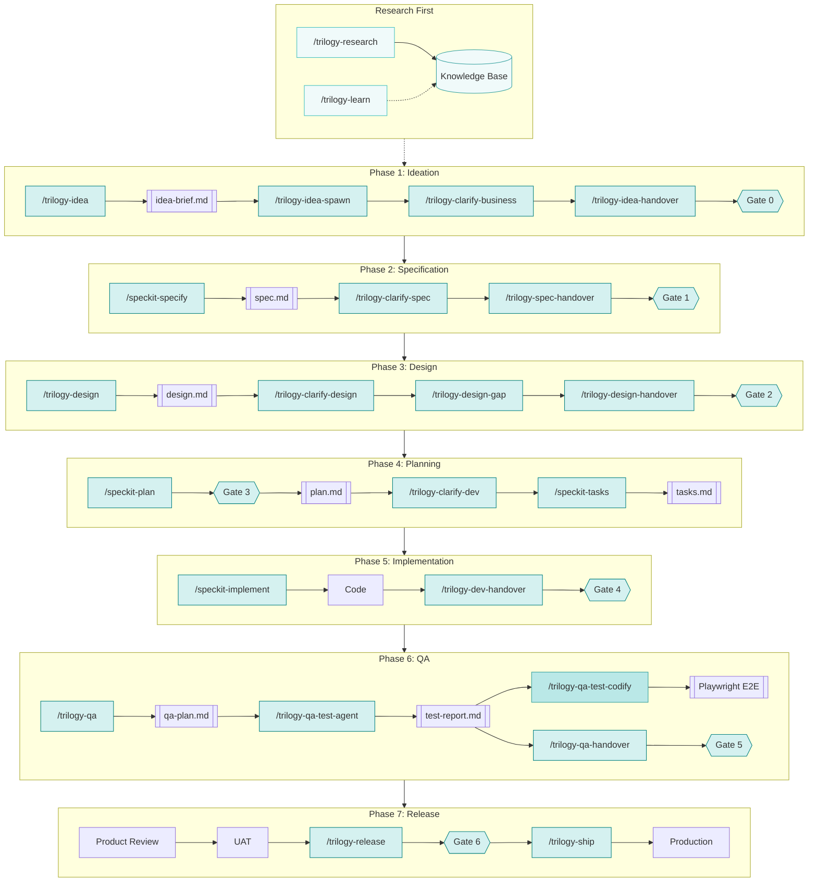

The complete journey from idea to production. Every feature passes through **7 quality gates** across **7 phases**, with status tracked in Linear at every transition.

:workflow-map

---

## Linear Status Lifecycle

Each gate transitions the Linear epic through a defined status. This is the single source of truth for where work sits.

```mermaid
flowchart LR
    G0(("0")) --> B[Backlog]
    B --> G1(("1"))
    G1 --> S[Start]
    S --> G2(("2"))
    G2 --> D[Dev]
    D --> G3(("3"))
    G3 --> D2[Dev]
    D2 --> G4(("4"))
    G4 --> D3[Dev]
    D3 --> G5(("5"))
    G5 --> D4[Dev]
    D4 --> G6(("6"))
    G6 --> C[Completed]

    style G0 fill:#D5F1F0,stroke:#007F7E
    style G1 fill:#D5F1F0,stroke:#007F7E
    style G2 fill:#D5F1F0,stroke:#007F7E
    style G3 fill:#D5F1F0,stroke:#007F7E
    style G4 fill:#D5F1F0,stroke:#007F7E
    style G5 fill:#D5F1F0,stroke:#007F7E
    style G6 fill:#D5F1F0,stroke:#007F7E

    style B fill:#f0f9ff,stroke:#3b82f6
    style S fill:#f0f9ff,stroke:#3b82f6
    style D fill:#f0f9ff,stroke:#3b82f6
    style D2 fill:#f0f9ff,stroke:#3b82f6
    style D3 fill:#f0f9ff,stroke:#3b82f6
    style D4 fill:#f0f9ff,stroke:#3b82f6
    style C fill:#f0fdf4,stroke:#22c55e
```

| Gate                 | Transition                | Skill                      | meta.yaml     |
| -------------------- | ------------------------- | -------------------------- | ------------- |
| **0 — Idea**         | Create epic → **Backlog** | `/trilogy-idea-handover`   | `backlog`     |
| **1 — Spec**         | Backlog → **Start**       | `/trilogy-spec-handover`   | `start`       |
| **2 — Design**       | Start → **Dev**           | `/trilogy-design-handover` | `in progress` |
| **3 — Architecture** | *(stays in Dev)*          | `/speckit-plan`            | *(no change)* |
| **4 — Code Quality** | *(stays in Dev)*          | `/trilogy-dev-handover`    | *(no change)* |
| **5 — QA**           | *(stays in Dev)*          | `/trilogy-qa-handover`     | *(no change)* |
| **6 — Release**      | Dev → **Completed**       | `/trilogy-release`         | `completed`   |

---

## Core Flow Diagram

This diagram shows only the **core (mandatory) skills** — the critical path from idea to production. Optional, visual, and support skills are available within each phase via the interactive workflow map above.

---

## The Phases

### Phase 1: Ideation

> "Is this idea clear enough to invest in?"

**Agent**: [`planning-agent`](/ways-of-working/claude-code-advanced/19-stage-agents) — chains ideation + specification skills, handles Gate 0 and Gate 1.

Capture the problem, not the solution. The idea brief is a 1-2 page document with a clear problem statement, proposed solution, and RACI with HOD acknowledgement.

| What                 | How                                                           |
| -------------------- | ------------------------------------------------------------- |
| Capture the problem  | `/trilogy-idea`                                               |
| Spawn ideas          | `/trilogy-idea-spawn` — interactive ideas board from brief + meeting transcript |
| Clarify business     | `/trilogy-clarify-business`                                   |
| **Gate 0**           | `/trilogy-idea-handover` — creates Linear epic in **Backlog** |

**Artifacts**: `idea-brief.md`, `ideas-board.html`

---

### Phase 2: Specification

> "Is this spec ready for design?"

**Agent**: [`planning-agent`](/ways-of-working/claude-code-advanced/19-stage-agents) — same agent continues from ideation through spec, handling Gate 1.

Detail what to build — precisely. User stories follow INVEST criteria with Given/When/Then acceptance criteria. Business language only, no implementation details.

| What                 | How                                                  |
| -------------------- | ---------------------------------------------------- |
| Write the spec       | `/speckit-specify`                                   |
| Clarify requirements | `/trilogy-clarify-spec`                              |
| Map user flows       | `/trilogy-flow` *(visual)*                           |
| **Gate 1**           | `/trilogy-spec-handover` — moves Linear to **Start** |

**Artifact**: `spec.md`

---

### Phase 3: Design

> "Is the design complete and ready to hand off to Dev?"

**Agent**: [`design-agent`](/ways-of-working/claude-code-advanced/19-stage-agents) — chains design brief, research, mockups, and design handover. Validates Gate 2.

Strategic design thinking first (kickoff), then clarify UX/UI decisions, then visual exploration (mockups). Edge cases, responsive approach, and accessibility are covered here.

| What              | How                                                  |
| ----------------- | ---------------------------------------------------- |
| Design kickoff    | `/trilogy-design`                                    |
| Clarify design    | `/trilogy-clarify-design`                            |
| UI exploration    | `/trilogy-mockup` *(visual)*                         |
| Gap assessment    | `/trilogy-design-gap`                                |
| **Gate 2**        | `/trilogy-design-handover` — moves Linear to **Dev** |

**Artifact**: `design.md`, `mockups/`

---

### Phase 4: Planning

> "Will the structure hold?"

**Agent**: [`dev-agent`](/ways-of-working/claude-code-advanced/19-stage-agents) — team lead that plans architecture (Gate 3), breaks into tasks, then spawns `backend-agent`, `frontend-agent`, and `testing-agent` teammates for parallel implementation (Gate 4).

Translate what into how. Data models, API design, component architecture, migration strategy. Break into implementable tickets.

| What               | How                                                  |
| ------------------ | ---------------------------------------------------- |
| Technical plan     | `/speckit-plan` — includes **Gate 3** (stays in Dev) |
| Clarify dev        | `/trilogy-clarify-dev`                               |
| Break into tickets | `/speckit-tasks`                                     |

**Artifact**: `plan.md`, `tasks.md`

---

### Phase 5: Implementation

> "Is the code ready to inspect?"

**Agent**: [`dev-agent`](/ways-of-working/claude-code-advanced/19-stage-agents) — continues from planning. Spawns `backend-agent`, `frontend-agent`, and `testing-agent` as an Agent Team for parallel implementation. Validates Gate 4 (Code Quality).

Build it. Models, migrations, controllers, data classes, Vue pages, tests. Follow Laravel and Vue best practices. Run Pint, run tests, achieve 80%+ coverage.

| What               | How                                                           |
| ------------------ | ------------------------------------------------------------- |
| Implement features | `/speckit-implement`                                          |
| Code review        | `/trilogy-review` *(optional)*                                |
| **Gate 4**         | `/trilogy-dev-handover` — validates code quality, creates PR  |

**Artifact**: Code, tests, PR

---

### Phase 6: QA

> "Does it actually work?"

**Agent**: [`qa-agent`](/ways-of-working/claude-code-advanced/19-stage-agents) — chains QA planning, browser testing, fix-and-retest, test codification, and QA handover. Validates Gate 5.

Verify the feature works as specified. Functional testing, cross-browser (Chrome, Safari, Firefox), responsive (desktop, tablet, mobile), accessibility (WCAG 2.1 AA).

| What           | How                                                 |
| -------------- | --------------------------------------------------- |
| QA test plan   | `/trilogy-qa` — generates qa-plan.md (no browser)   |
| Execute tests  | `/trilogy-qa-test-agent` — browser testing + fixes  |
| Codify tests   | `/trilogy-qa-test-codify` — Playwright E2E *(optional)* |
| **Gate 5**     | `/trilogy-qa-handover`                              |

**Artifacts**: `qa-plan.md`, `test-report.md`

---

### Phase 7: Release

> "May this enter the city?"

**Agent**: [`release-agent`](/ways-of-working/claude-code-advanced/19-stage-agents) — chains release validation, release notes, and deployment sign-off. Validates Gate 6, transitions to Completed.

Product Owner validates business value. Business stakeholders run UAT. All approvals captured before production. Ship with confidence.

| What           | How                                                |
| -------------- | -------------------------------------------------- |
| Product review | Product Owner sign-off                             |
| UAT            | Business stakeholder validation                    |
| **Gate 6**     | `/trilogy-release` — moves Linear to **Completed** |
| Deploy         | `/trilogy-ship`                                    |

**Artifact**: `release-notes.md`

---

## Scaling to Complexity

Not every feature needs the full journey. Scale to the work:

| Feature Size                 | Gates                           | Example         |
| ---------------------------- | ------------------------------- | --------------- |
| **Trivial** (typo fix)       | Just implement it               | Fix a label     |
| **Small** (single component) | Spec → Plan → Implement         | Add a filter    |
| **Medium** (feature)         | Full workflow, simplified gates | New report page |
| **Large** (epic)             | Full workflow, all 7 gates      | Needs v2 module |

---

## Quick Links

- [Quality Gates](/ways-of-working/spec-driven-development/10-quality-gates) — Gate details, checklists, and owners
- [Skills Reference](/ways-of-working/spec-driven-development/09-skills-reference) — Complete skill catalogue
- [Video Walkthroughs](/ways-of-working/spec-driven-development/06-video-walkthroughs) — Watch each phase demonstrated
- [Examples](/ways-of-working/spec-driven-development/02-examples) — Real artifacts from past epics
