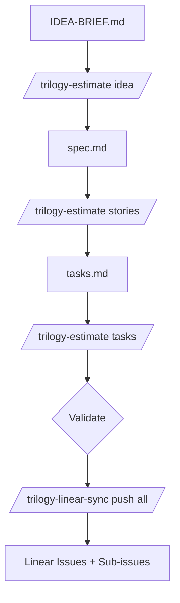

## Overview

Estimation happens at three levels, each with its own unit. Once estimated, work syncs to Linear for project tracking.

```
IDEA-BRIEF.md  →  /trilogy-estimate idea    →  T-shirt (S/M/L)
     ↓
spec.md        →  /trilogy-estimate stories →  Days per story
     ↓
tasks.md       →  /trilogy-estimate tasks   →  Points per task
     ↓
/trilogy-linear-sync push all               →  Linear
```

::estimation-calculator
::

---

## The Three Levels

| Level | Unit | Where It Goes | Cost Conversion |
|-------|------|---------------|-----------------|
| **Idea** | T-shirt (S/M/L) | Section in IDEA-BRIEF.md | S: $15-30k, M: $60-120k, L: $180k+ |
| **Story** | Days | Inline in spec.md | 1 day = ~$3k |
| **Task** | Points (1-8) | Inline in tasks.md | 1 pt ≈ 0.5 days |

### Conversion Math

```
1 day = ~$3k
1 sprint = 10 days = ~$30k
1 point ≈ 0.5 days ≈ $1.5k
20 points = 1 sprint = 10 days
```

---

## Level 1: Idea Brief (T-Shirt)

High-level sizing before detailed specification.

```bash
/trilogy-estimate idea
```

### T-Shirt Rubric

| Size | Days | Cost | When to Use |
|------|------|------|-------------|
| **S** | 5-10 | $15-30k | Single flow, few files, no integrations |
| **M** | 20-40 | $60-120k | Multiple flows, new tables, one integration |
| **L** | 60+ | $180k+ | Cross-cutting, multiple integrations, migration |

### Output

Adds section to IDEA-BRIEF.md:

```markdown
## Estimated Effort

| Metric | Value |
|--------|-------|
| **Size** | M (Medium) |
| **Days** | 25-35 |
| **Cost Range** | ~$75-105k |
| **Confidence** | Medium |

**Key Drivers**: Multiple user types, new data model, external integration
```

---

## Level 2: Stories (Days)

Estimate each user story after specification.

```bash
/trilogy-estimate stories
```

### Story Sizing Guide

| Size | Days | Cost | Indicators |
|------|------|------|------------|
| **XS** | 1-2 | $3-6k | Single endpoint, simple UI |
| **S** | 3-5 | $9-15k | One flow, few files |
| **M** | 8-12 | $24-36k | Multiple files, some complexity |
| **L** | 15-20 | $45-60k | Cross-cutting, integrations |
| **XL** | 25+ | $75k+ | Major feature, high risk |

### Output

**Inline** (after each story heading):

```markdown
### User Story 1 - First-Login Flow (Priority: P1)

> **Estimate**: 8 days | ~$24k | High confidence

As a new recipient...
```

**Summary section** (end of spec.md):

```markdown
## Effort Estimate

**Generated**: 2026-01-31 | **Size**: Large (L) | **Confidence**: Medium

### Story Breakdown

| Story | Priority | Days | Cost | Notes |
|-------|----------|------|------|-------|
| US01 - First-Login | P1 | 8 | ~$24k | Core |
| US02 - Signing | P1 | 12 | ~$36k | E-sig |
| **Total** | | **85** | **~$255k** | |
```

---

## Level 3: Tasks (Points)

Point each task after task breakdown.

```bash
/trilogy-estimate tasks
```

### Task Pointing Guide

| Points | Complexity | Time | Example |
|--------|------------|------|---------|
| **1** | Trivial | ~2-4 hrs | Config, env var |
| **2** | Simple | ~half day | One file change |
| **3** | Medium | ~1 day | Few files |
| **5** | Complex | ~2-3 days | Multiple files, unknowns |
| **8** | Large | ~4-5 days | Cross-cutting, spike needed |

**Rule**: If > 8 points, break the task down.

### Output

**Inline** (points after [US] label):

```markdown
- [ ] T001 [US1] `3` Create Agreement model in app/Models/
- [ ] T002 [US1] `2` Create AgreementPolicy
- [ ] T003 [US1] `5` Create first-login middleware
```

**Sprint allocation** (end of tasks.md):

```markdown
## Sprint Allocation

**Velocity**: ~20 pts/sprint (~10 days)

### Points by Story

| Story | Points | Days |
|-------|--------|------|
| US01 | 16 | ~8 |
| US02 | 24 | ~12 |
| **Total** | **40** | **~20** |
```

---

## Validation

When multiple levels exist, `/trilogy-estimate` validates consistency:

### Tasks → Stories

```
Sum task points × 0.5 = Days
Compare to story estimate
Flag if delta > 25%
```

### Stories → Idea

```
Sum story days
Compare to T-shirt size
S = 5-10 days, M = 20-40 days, L = 60+ days
```

### Example Output

```markdown
### Validation Notes

⚠️ US02 estimated at 10 days but tasks total 15 days (30 pts)
   - Consider: increase story estimate OR reduce task scope

✅ Total days (85) aligns with L size estimate in idea brief
```

---

## Syncing to Linear

After estimating, sync to Linear for project tracking.

```bash
/trilogy-linear-sync push all
```

### What Syncs Where

| Artifact | Linear Destination | Estimate Handling |
|----------|-------------------|-------------------|
| **Stories** | Issues (User Story label) | Days in description text |
| **Tasks** | Sub-issues under stories | Points → estimate field |
| **Docs** | Linear Document | IDEA-BRIEF + spec content |

### Story Description in Linear

The estimate becomes part of the issue description:

```markdown
> **Estimate**: 8 days | ~$24k | High confidence

**As a** new recipient
**I want to** be guided to sign my HCA on first login
**So that** I can quickly begin receiving services

## Acceptance Criteria

- [ ] Given I am a new recipient with an HCA in "Sent" state...
```

### Task Points in Linear

Task points sync to Linear's estimate field:

```markdown
- [ ] T001 [US1] `3` Create Agreement model
```

→ Linear sub-issue with `estimate: 3`

Linear then rolls up points across the project for velocity tracking.

---

## The Full Flow



### Commands in Order

::steps
  :::step{title="Estimate idea (early sizing)"}
  ```bash
  /trilogy-estimate idea
  ```
  :::
  :::step{title="Write spec"}
  ```bash
  /speckit-specify
  ```
  :::
  :::step{title="Estimate stories"}
  ```bash
  /trilogy-estimate stories
  ```
  :::
  :::step{title="Generate tasks"}
  ```bash
  /speckit-tasks
  ```
  :::
  :::step{title="Estimate tasks"}
  ```bash
  /trilogy-estimate tasks
  ```
  :::
  :::step{title="Sync to Linear"}
  ```bash
  /trilogy-linear-sync push all
  ```
  :::
::

---

## Re-Estimating

Running `/trilogy-estimate` again updates existing estimates:

- **Inline estimates** get replaced (looks for `> **Estimate**:` or backtick points)
- **Summary sections** get replaced
- **Cross-level validation** runs again

This lets you refine estimates as understanding improves.

---

## Calibration Rules

### The "Weeks → Days" Rule

AI tends to underestimate. Apply this calibration:

| AI Says | Interpret As | Why |
|---------|--------------|-----|
| "2 weeks" | 3-4 days | Review, testing, deployment |
| "1 month" | 8-10 days | Integration, edge cases |
| "1 quarter" | 20-30 days | Architecture, coordination |

### Red Flags (Add Buffer)

If ANY apply, add 25-50% buffer:

- First time touching this codebase area
- Legacy code with no tests
- Coordination with another team
- Compliance/audit implications
- Billing or financial data
- Performance-sensitive
- External API with rate limits
- Data migration required

### Confidence Levels

| Level | Variance | When |
|-------|----------|------|
| **High** | ±20% | Well-understood, similar past work |
| **Medium** | ±50% | Some unknowns, need spike |
| **Low** | ±100% | New territory, recommend splitting |

---

## See Also

- [Skills Reference](/ways-of-working/spec-driven-development/09-skills-reference) - All available skills
- [Workflow Map](/ways-of-working/spec-driven-development/01-workflow-map) - Visual workflow reference
- [Quality Gates](/ways-of-working/spec-driven-development/10-quality-gates) - Gate requirements
