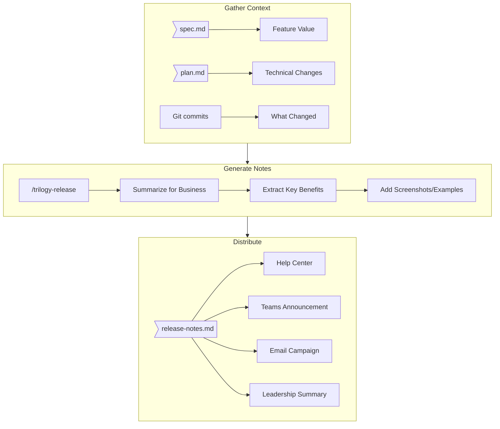

# Release Notes Process

The final phase of Spec-Driven Development is communicating what you built to stakeholders. Great release notes bridge the gap between technical implementation and business value.

---

## Why Release Notes Matter

| Without Good Release Notes | With Good Release Notes |
|---------------------------|-------------------------|
| Support team learns about features from users | Support team is prepared before release |
| Stakeholders don't know what shipped | Leadership can report on delivery |
| Users miss new features | Users adopt features faster |
| Value of work is invisible | Team's impact is visible |

**Release notes are how your work becomes visible to the business.**

---

## The Release Notes Workflow



---

## Writing for Business Stakeholders

### The Golden Rule

> **Business stakeholders don't care HOW you built it. They care WHAT it does for them.**

### Bad vs Good Examples

| Bad (Technical) | Good (Business Value) |
|----------------|----------------------|
| "Refactored BudgetService to use pipeline pattern" | "Budget calculations are now 3x faster" |
| "Added new Vue component for timeline visualization" | "See fee history at a glance with the new timeline view" |
| "Implemented eager loading for related models" | "Package pages load instantly instead of waiting" |
| "Created new API endpoint for statement generation" | "Generate professional PDF statements with one click" |

### The WHAT-WHY-HOW Framework

For each feature, answer:

1. **WHAT** changed? (1 sentence, business language)
2. **WHY** does it matter? (user benefit)
3. **HOW** do I use it? (brief instructions)

**Example:**

```markdown
### Support at Home Statements

**WHAT:** Generate professional PDF statements for S@H packages directly from the Portal.

**WHY:** No more manual statement preparation. Complete visibility of spending, funding, and contributions in one document.

**HOW:** Navigate to any S@H package → Click "Generate Statement" → Select period → Download PDF.
```

---

## Release Notes Structure

Every release note should follow this template:

```markdown
---
title: "Feature Name"
description: "One-line summary"
date: YYYY-MM-DD
version: "X.Y"
ticket: TP-XXXX
category: feature | improvement | fix
impact: high | medium | low
---

# Feature Name

**Released:** [Date] | **Ticket:** [Link] | **Impact:** [Level]

---

## What's New

[2-3 sentences describing the feature in business terms]

### Key Capability

[Description of the main capability]

**How it works:**
1. [Step 1]
2. [Step 2]
3. [Step 3]

**Who benefits:** [User personas]

---

## Key Features

### Feature Area 1
[Description]

### Feature Area 2
[Description]

---

## Technical Notes

<details>
<summary>For developers</summary>

- Technical detail 1
- Technical detail 2

</details>
```

---

## Summarizing for Different Audiences

### For End Users (Help Center)

Focus on:
- What they can now do
- Step-by-step instructions
- Screenshots showing the feature
- Common questions

**Tone:** Friendly, instructional, no jargon

### For Support Team

Focus on:
- What changed and where
- Common questions to expect
- How to troubleshoot issues
- What's NOT included

**Tone:** Practical, comprehensive

### For Leadership

Focus on:
- Business value delivered
- User impact metrics (if available)
- Strategic alignment
- What's coming next

**Tone:** Executive summary, outcome-focused

**Template:**

```markdown
## Leadership Summary: [Feature Name]

**Delivered:** [Date]
**Business Value:** [1-sentence value statement]

### Impact
- [Metric or outcome 1]
- [Metric or outcome 2]

### Strategic Alignment
[How this supports business goals]

### Next Steps
[What's coming in this area]
```

---

## The /trilogy-release Skill

Use `/trilogy-release` to automate release note generation:

```bash
/trilogy-release                    # Full release package
/trilogy-release --notes            # Just release notes
/trilogy-release --comms            # Just communication plan
/trilogy-release --summary          # Leadership summary only
```

### What It Generates

1. **release-notes.md** - Stakeholder-facing notes
2. **Communication Plan** - Who to notify, when
3. **Documentation Suggestions** - Domain docs to update
4. **Release Gate Checklist** - Final approval items

---

## Communication Timing

| When | What | Who |
|------|------|-----|
| **2-3 days before** | Brief Support team | PM |
| **1 day before** | Internal Teams notification | PM |
| **Release day** | Post in #releases | Dev |
| **Same day** | Publish Help Center | PM |
| **Same day** | User announcement (if applicable) | PM |
| **Next day** | Review feedback | PM |
| **Week 1** | Leadership summary | PM |

---

## Best Practices

### Do

- Write in plain English
- Lead with user benefit
- Include screenshots for UI changes
- Provide "how to use it" steps
- Link to detailed docs

### Don't

- Use technical jargon
- List implementation details
- Assume readers know context
- Skip the "why it matters"
- Forget Support team briefing

---

## Examples

### Feature Release

```markdown
# Support at Home Statements

Staff can now generate comprehensive PDF statements for Support at Home packages directly from the Portal.

**What's new:**
- Generate professional statements with budget summaries
- View contributions and expense breakdowns
- Download or email to clients instantly

**How to use it:**
1. Open any S@H package
2. Click "Generate Statement"
3. Select the statement period
4. Download or send via email
```

### Bug Fix

```markdown
# Budget Calculation Fix

Budget totals now correctly include pending consumptions, ensuring accurate remaining balance displays.

**What changed:**
- Budget remaining now accounts for pending items
- No action required - calculations are automatic

**Impact:** Staff will see accurate budget balances reflecting all pending services.
```

### Improvement

```markdown
# Faster Package Loading

Package detail pages now load 60% faster, especially for packages with extensive history.

**What's improved:**
- Immediate page display
- Background loading for history
- Smoother scrolling

**No action required** - improvements apply automatically.
```

---

## Release Notes in TC-DOCS

All release notes are stored in:

```
.tc-docs/content/release-notes/
├── index.md                              # Overview and recent releases
├── 2026-02-03-sah-statements.md         # Individual release
├── 2026-02-02-care-coordinator-fee.md   # Individual release
└── ...
```

Each initiative also has its release plan:

```
initiatives/[Category]/[Epic]/context/
├── release-plan.md      # Full release package
└── release-notes.md     # Stakeholder notes (copied to release-notes/)
```

---

## Integration with Workflow

Release notes are the final output of the SDD workflow:

```
Idea → Spec → Design → Plan → Code → QA → Release Notes → Production
```

The **Release Gate** (Gate 6) validates:
- [ ] Release notes prepared
- [ ] Communication plan ready
- [ ] Support team briefed
- [ ] Help Center updated
- [ ] Stakeholder approval received

---

## See Also

- [Release Gate Details](/ways-of-working/spec-driven-development/10-quality-gates#gate-6-release-gate)
- [Release Notes Section](/release-notes)
- [trilogy-release Skill](/ways-of-working/spec-driven-development/09-skills-reference#trilogy-release)
